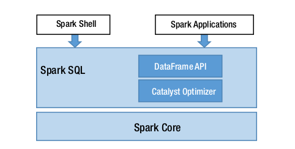

# Spark SQL Cheat sheet
The Spark SQL module consists of two main parts. The first one is the representation of the Structure APIs, called DataFrames and Datasets, that define the high-level APIs for working with structured data. The DataFrame concept was inspired by the Python pandas DataFrame; the main difference is that a DataFrame in Spark can handle a large volume of data that is spread across many machines. The second part of the Spark SQL module is the Catalyst optimizer, which does all the hard work behind the scenes to make your life easier and to speed up your data processing logic. One of the cool features the Spark SQL module offers is the ability to execute SQL queries to perform data processing.
The figure below shows how the Spark SQL component is built on top of the good old reliable Spark Core component.


	
## DataFrames
A DataFrame is an immutable, distributed collection of data that is organized into rows, where each one consists a set of columns and each column has a name and an associated type. In other words, this distributed collection of data has a structure defined by a schema. If you are familiar with the table concept in a relational database management system (RDBMS), then you will realize that a DataFrame is essentially equivalent. Each row in the DataFrame is represented by a generic Row object.

### Creating DataFrames
DataFrames can be created by reading data from the many structured data sources as well as by reading data from tables in Hive and databases.
In addition, the Spark SQL module makes it easy to convert an RDD to a DataFrame by providing the schema information about the data in the RDD. The DataFrame APIs are available in Scala, Java, Python, and R.

#### Creating Dataframes from RDDs
Let’s start with creating a DataFrame from an RDD.
- Creating a DataFrame from an RDD of Numbers
```
import scala.util.Random
val rdd = spark.sparkContext.parallelize(1 to 10).map(x => (x, Random.nextInt(100)* x))
val kvDF = rdd.toDF("key","value")
```
Another way to create a DataFrame is by specifying an RDD with a schema that is created programmatically.
- Creating a DataFrame from an RDD with a Schema Created Programmatically
```
import org.apache.spark.sql.Row
import org.apache.spark.sql.types._
val peopleRDD = spark.sparkContext.parallelize(Array(Row(1L, "John Doe",  30L),
                                                     Row(2L, "Mary Jane", 25L)))
val schema = StructType(Array(
        StructField("id", LongType, true),
        StructField("name", StringType, true),
        StructField("age", LongType, true)
))
val peopleDF = spark.createDataFrame(peopleRDD, schema)
```
#### Creating Dataframes from a Range of Numbers
Spark 2.0 introduced a new entry point for Spark applications. It is represented by a class called SparkSession, which has a convenient function called range that can easily create a DataFrame with a single column with the name id and the type LongType. This function has a few variations that can take additional parameters to specify the start and end of a range as well as the steps of the range.
- Using the SparkSession.range Function to Create a DataFrame
```
val df1 = spark.range(5).toDF("num").show

val df2 = spark.range(5,10).toDF("num").show

val df3 = spark.range(5,15,2).toDF("num").show // The last param represents the step size
```
Notice the range function can create only a single-column DataFrame.
One option to create a multicolumn DataFrame is to use Spark’s implicits that convert a collection of tuples inside a Scala Seq collection.
- Converting a Collection Tuple to a DataFrame Using Spark’s toDF Implicit
```
val movies = Seq(("Damon, Matt", "The Bourne Ultimatum", 2007L),
                 ("Damon, Matt", "Good Will Hunting", 1997L))
val moviesDF = movies.toDF("actor", "title", "year")
```

#### Creating DataFrames from Data Sources
Out of the box, Spark SQL supports six built-in data sources, where each data source is
mapped to a data format. The data source layer in the Spark SQL module is designed to
be extensible, so custom data sources can be easily integrated into the DataFrame APIs.
There are hundreds of custom data sources written by the Spark community, and it is not
too difficult to implement them.
The two main classes in Spark SQL for reading and writing data are DataFrameReader and DataFrameWriter, respectively.
An instance of the DataFrameReader class is available as the read variable of the SparkSession class.
- Common Pattern for Interacting with DataFrameReader
```
spark.read.format(...).option("key", value").schema(...).load()
```
- Specifying the Data Source Format
```
spark.read.json("<path>")
spark.read.format("json")
spark.read.parquet("<path>")
spark.read.format("parquet")
spark.read.jdbc
spark.read.format("jdbc")
spark.read.orc("<path>")
spark.read.format("orc")
spark.read.csv("<path>")
spark.read.format("csv")
spark.read.text("<path>")
spark.read.format("text")
// custom data source – fully qualifed package name
spark.read.format("org.example.mysource")
```
- Reading the README.md File As a Text File from a Spark Shell
```
val textFile = spark.read.text("README.md")
```
- Reading CSV Files with Various Options
```
val movies = spark.read.option("header","true").csv("<path>/book/chapter4/data/movies.csv")
```
- Various Examples of Reading a JSON File
```
val movies5 = spark.read.json("<path>/book/chapter4/data/movies/movies.json")
```
```
Specify a schema to override the Spark's inferring schema.
producted_year is specified as integer type
import org.apache.spark.sql.types._
val movieSchema2 = StructType(Array(StructField("actor_name", StringType, true),
                             StructField("movie_title", StringType, true),
                             StructField("produced_year", IntegerType, true)))
val movies6 = spark.read.option("inferSchema","true").schema(movieSchema2)
                              .json("<path>/book/chapter4/data/movies/movies.json")
```
- Reading a Parquet File in Spark
```
Parquet is the default format, so don't need to specify the format when reading
val movies9 = spark.read.load("<path>/book/chapter4/data/movies/movies.parquet")           
```
If we want to be more explicit, we can specify the path to the parquet
function
```
val movies10 = spark.read.parquet("<path>/book/chapter4/data/movies/movies.parquet")
```
- Reading an ORC File in Spark
```
val movies11 = spark.read.orc("<path>/book/chapter4/data/movies/movies.orc")
```
- Create Dataframes from jdbc
```
// First, connect MySQL ot Spark

import java.sql.DriverManager
val connectionURL = "jdbc:mysql://localhost:3306/<table>?user=<username>&password=<password>"
val connection = DriverManager.getConnection(connectionURL)
connection.isClosed()
connection close()
```
```
//Reading Data from a Table in MySQL Server

val mysqlURL= "jdbc:mysql://localhost:3306/sakila"
val filmDF = spark.read.format("jdbc").option("driver", "com.mysql.jdbc.Driver")
                                      .option("url", mysqlURL)
                                      .option("dbtable", "film")
                                      .option("user", "<username>")
                                      .option("password","<password>")
                                      .load()
```


### Working with Structured Operations
Unlike the RDD operations, the structured operations are designed to be more relational, meaning these operations mirror the kind of expressions you can do with SQL, such as projection, filtering, transforming, joining, and so on. Similar to RDD operations, the structured operations are divided into two categories: transformation and action. The semantics of the structured transformations and actions are identical to the ones in RDDs. In other words, structured transformations are lazily evaluated, and structured actions are eagerly evaluated.

#### Working with Columns

- Different Ways of Referring to a Column
```
import org.apache.spark.sql.functions._
val kvDF = Seq((1,2),(2,3)).toDF("key","value")
// to display column names in a DataFrame, we can call the columns function
kvDF.columns
Array[String] = Array(key, value)
kvDF.select("key")
kvDF.select(col("key"))
kvDF.select(column("key"))
kvDF.select($"key")
kvDF.select('key)
// using the col function of DataFrame
kvDF.select(kvDF.col("key"))
kvDF.select('key, 'key > 1).show
```
#### Working with Structured Transformations
- Creating the movies Dataframe from a Parquet file
```
val movies = spark.read.parquet("<path>/chapter4/data/movies/movies.parquet")
```
##### select(columns)
This transformation is commonly used to perform projection, meaning selecting all
or a subset of columns from a DataFrame. During the selection, each column can be transformed via a column expression. There are two variations of this transformation. One takes the column as a string, and the other takes columns as the Column class. This transformation does not permit you to mix the column type when using one of these two variations.
- Two Variations of the select Transformation
```
movies.select("movie_title","produced_year").show(5)

// using a column expression to transform year to decade
movies.select('movie_title,('produced_year - ('produced_year % 10)).as("produced_decade")).show(5)
```
##### selectExpr(expressions)
This transformation is a variant of the select transformation. The one big difference is that it accepts one or more SQL expressions, rather than columns. However, both are essentially performing the same projection task. SQL expressions are powerful and flexible constructs to allow you to express column transformation logic in a natural way, just like the way you think. You can express SQL expressions in a string format, and Spark will parse them into a logical tree so they will be evaluated in the right order.
- Adding the decade Column to the movies DataFrame Using a SQL Expression
```
movies.selectExpr("*","(produced_year - (produced_year % 10)) as decade").
show(5)
```
- Using a SQL Expression and Built-in Functions
```
movies.selectExpr("count(distinct(movie_title)) as movies","count(distinct(actor_name)) as actors").show
```
##### filler(condition), where(condition)
This transformation is a fairly straightforward one to understand. It is used to filter out the rows that don’t meet the given condition, in other words, when the condition evaluates to false. A different way of looking at the behavior of the filter transformation is that it returns only the rows that meet the specified condition. Both the filter and where transformations have the same behavior, so pick the one you are most comfortable with. The latter one is just a bit more relational than the former.
- Filter Rows with Logical Comparison Functions in the Column Class
```
movies.filter('produced_year < 2000)
movies.where('produced_year > 2000)
movies.filter('produced_year >= 2000)
movies.where('produced_year >= 2000)
// equality comparison requires 3 equal signs
movies.filter('produced_year === 2000).show(5)
// inequality comparison uses an interesting looking operator =!=
movies.select("movie_title","produced_year").filter('produced_year =!=2000).show(5)
// to combine one or more comparison expressions, we will use either the OR and AND expression operator
movies.filter('produced_year >= 2000 && length('movie_title) < 5).show(5)
// the other way of accomplishing the same result is by calling the filter function two times
movies.filter('produced_year >= 2000).filter(length('movie_title) < 5).show(5)
```
##### distinct, dropDuplicates
These two transformations have identical behavior. However, dropDuplicates allows you to control which columns should be used in deduplication logic. If none is specified, the deduplication logic will use all the columns in the DataFrame.
- Using distinct and dropDuplicates to Achieve the Same Goal
```
movies.select("movie_title").distinct.selectExpr("count(movie_title) as movies").show
movies.dropDuplicates("movie_title").selectExpr("count(movie_title) as movies").show
```
##### sort(columns), orderBy(columns)
Both of these transformations have the same semantics. The orderBy transformation is more relational than the other one. By default, the sorting is in ascending order, and it is fairly easy to change it to descending. When specifying more than one column, it is possible to have a different order for each of the columns.
- Sorting the DataFrame in Ascending and Descending Order
```
val movieTitles = movies.dropDuplicates("movie_title")
                        .selectExpr("movie_title", "length(movie_title) as
			 title_length", , "produced_year")
movieTitles.sort('title_length).show(5)
// sorting in descending order
movieTitles.orderBy('title_length.desc).show(5)
// sorting by two columns in different orders
movieTitles.orderBy('title_length.desc, 'produced_year).show(5)
```
##### limit(n)
This transformation returns a new DataFrame by taking the first n rows. This transformation is commonly used after the sorting is done to figure out the top n or bottom n rows based on the sorting order.
- Using the limit Transformation to Figure Out the Top Ten Actors with the Longest Names
```
// first create a DataFrame with their name and associated length
val actorNameDF = movies.select("actor_name").distinct.selectExpr("*", "length(actor_name) as length")
// order names by length and retrieve the top 10
actorNameDF.orderBy('length.desc).limit(10).show
```
##### union(otherDataFrame)
We learned earlier that DataFrames are immutable. So if there is a need to add more rows to an existing DataFrame, then the union transformation is useful for that purpose as well as for combining rows from two DataFrames. This transformation requires both DataFrames to have the same schema, meaning both column names and their order must exactly match.
- Adding a Missing Actor to the movies DataFrame
```
// we want to add a missing actor to movie with title as "12"
val shortNameMovieDF = movies.where('movie_title === "12")

// create a DataFrame with one row
import org.apache.spark.sql.Row
val forgottenActor = Seq(Row("Brychta, Edita", "12", 2007L))
val forgottenActorRDD = spark.sparkContext.parallelize(forgottenActor)
val forgottenActorDF = spark.createDataFrame(forgottenActorRDD,shortNameMovieDF.schema)

// now adding the missing actor
val completeShortNameMovieDF = shortNameMovieDF.union(forgottenActorDF)
```
##### withColumn(colName, column)
This transformation is used to add a new column to a DataFrame. It requires two input parameters: a column name and a value in the form of a column expression. You can accomplish pretty much the same goal by using the selectExpr transformation. However, if the given column name matches one of the existing ones, then that column is replaced with the given column expression.
- Adding a Column As Well As Replacing a Column Using the withColumn Transformation
```
// adding a new column based on a certain column expression
movies.withColumn("decade", ('produced_year - 'produced_year % 10)).show(5)

// now replace the produced_year with new values
movies.withColumn("produced_year", ('produced_year - 'produced_year % 10)).
show(5)
```
##### withColumnRenamed(existingColName, newColName)
This transformation is strictly about renaming an existing column name in a DataFrame. Notice that if the provided existingColName doesn’t exist in the schema, Spark doesn’t throw an error, and it will silently do nothing.
- Using the withColumnRenamed Transformation to Rename Some of the Column Names
```
movies.withColumnRenamed("actor_name", "actor")
      .withColumnRenamed("movie_title", "title")
      .withColumnRenamed("produced_year", "year").show(5)
```
##### drop(columnName1, columnName2)
This transformation simply drops the specified columns from the DataFrame. You can specify one or more column names to drop, but only the ones that exist in the schema will be dropped and the ones that don’t will be silently ignored.
```
movies.drop("actor_name", "me").printSchema
```
##### sample(fraction), sample(fraction, seed), sample(fraction, seed, withReplacement)
This transformation returns a randomly selected set of rows from the DataFrame. The number of the returned rows will be approximately equal to the specified fraction, which represents a percentage, and the value has to be between 0 and 1.
- Different Ways of Using the sample Transformation
```
// sample with no replacement and a fraction
movies.sample(false, 0.0003).show(3)

// sample with replacement, a fraction and a seed
movies.sample(true, 0.0003, 123456).show(3)
```
##### randomSplit(weights)
This transformation is commonly used during the process of preparing the data to train machine learning models. Unlike the previous transformations, this one returns one or more DataFrames. The number of DataFrames it returns is based on the number of weights you specify. If the provided set of weights don’t add up to 1, then they will be
normalized accordingly to add up to 1.
- Using randomSplit to split the movies DataFrames into Three Parts
```
// the weights need to be an Array
val smallerMovieDFs = movies.randomSplit(Array(0.6, 0.3, 0.1))
```
#### Working with Missing or Bad Data
- Dropping Rows with Missing Data
```
// dropping rows that have missing data in any column
// both of the lines below will achieve the same purpose
badMoviesDF.na.drop().show
badMoviesDF.na.drop("any").show

// drop rows that have missing data in every single column
badMoviesDF.na.drop("all").show

// drops rows when column actor_name has missing data
badMoviesDF.na.drop(Array("actor_name")).show
```
##### describe(columnNames)
- Use the describe Transformation to Show Statistics for the produced_year Column
```
movies.describe("produced_year").show
```
#### Working with Structured Actions


